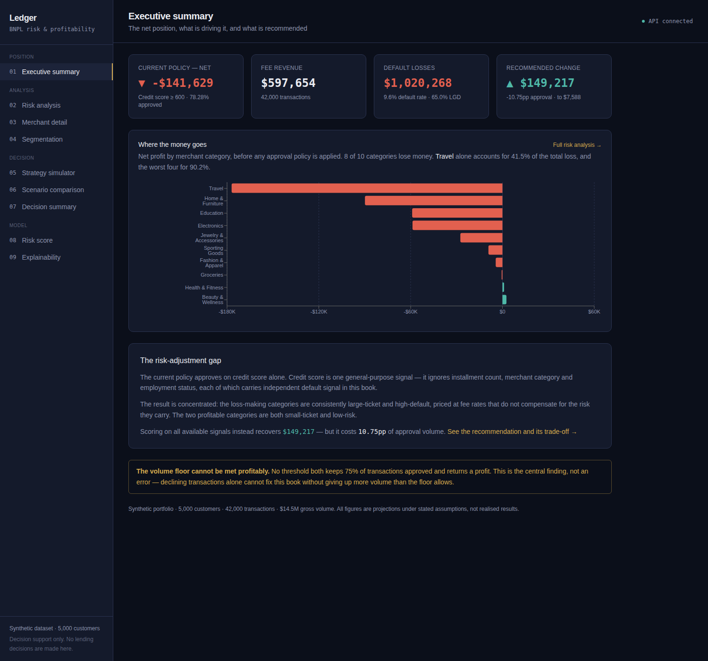
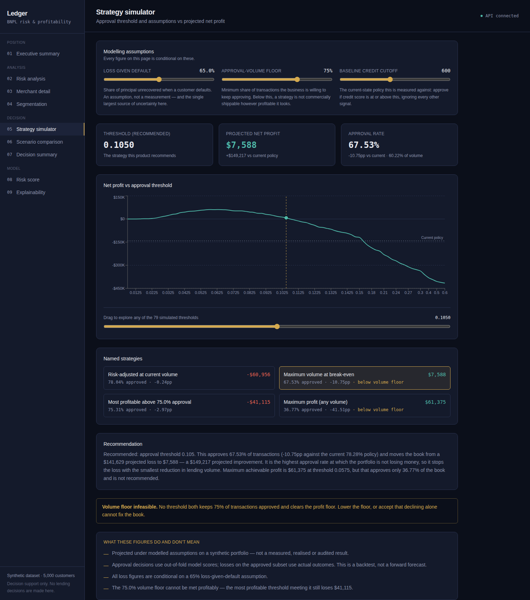
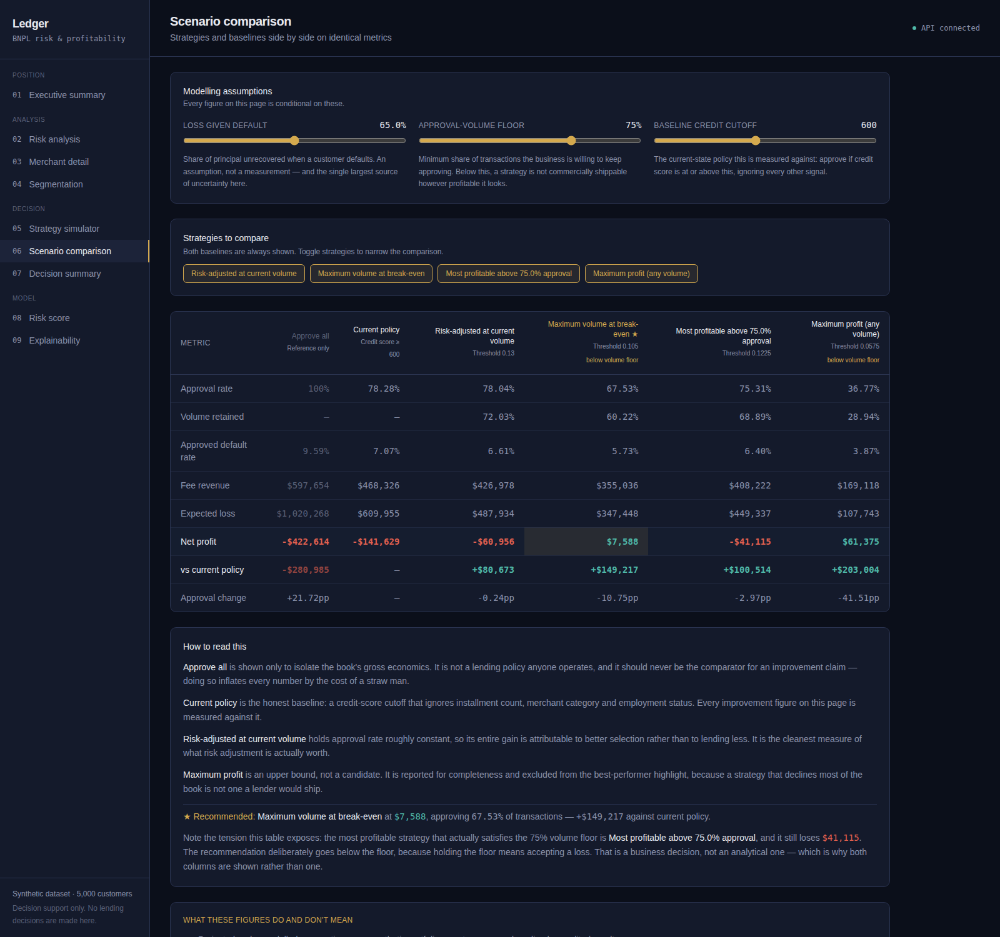

# LedgerGuard

## BNPL Risk & Profitability Decision Platform

A decision-support platform for Buy Now, Pay Later underwriting: it attributes where a lending book is losing money, simulates alternative approval strategies against explicit assumptions, and reports the trade-off each one costs — rather than handing back a single "optimal" number.

Built on a synthetic portfolio of **5,000 customers and 42,000 transactions**.



---

## Executive summary

A conventional credit-score underwriting policy on this portfolio approves 78.28% of applications and loses a projected **$141,629**.

The cause is a **risk-adjustment gap**: credit score is one general-purpose signal, and it ignores installment count, merchant category and employment status — each of which carries independent default signal here. The loss is concentrated, not spread. Two of ten merchant categories are profitable; **Travel alone accounts for 41.5%** of the total category loss, and four categories account for 90.2%.

Replacing the credit-score cutoff with model-based approval scoring, tuned to the highest approval rate at which the book stops losing money, is projected to move it from a **$141,629 loss to $7,588 profit — a $149,217 improvement — at a 10.75pp reduction in approval rate.**

Every figure above is a projection on synthetic data under stated assumptions. None of it is a realised result. The platform makes no lending decisions.

---

## The business problem

A BNPL lender earns a merchant fee on every approved transaction and absorbs the unrecovered principal when a customer defaults. Profitability is therefore decided almost entirely by the approval policy — and the people who own that decision (risk, product, finance, executive) typically cannot interrogate it. The analysis lives in SQL and notebooks. There is no way to ask *what happens if we approve differently*, and no way to compare answers on consistent terms.

---

## Key finding

**Declining transactions cannot fix this book at an acceptable approval rate.**

Every strategy that reaches profitability does so by lending less. The most profitable strategy of all approves just 36.77% of the book — arithmetically optimal, commercially illiterate. And the configured 75% volume floor turns out to be **infeasible**: the most profitable threshold that holds 75% approval still loses $41,115.

That constraint conflict is the product's central output, and it points at the lever the analysis could not test: **risk-based pricing**. Charging a fee rate that compensates for segment risk is the only option that could plausibly hold both volume and margin, and it is the top item on the [forward backlog](docs/product-backlog.md#forward-backlog--not-built).

---

## Product solution

Five screens, in the order a reader works through them.

| Screen | Question it answers |
|---|---|
| **Executive summary** | What is the net position, and what is driving it? |
| **Risk analysis** | Which categories lose money, and why? Sortable, filterable, with drill-down. |
| **Strategy simulator** | What happens to profit, approval rate and loss rate as the policy changes? |
| **Scenario comparison** | How do the options compare against both baselines on identical metrics? |
| **Decision summary** | What is recommended, what does it cost, and what could invalidate it? |



---

## Target users

Four [hypothetical personas](docs/personas.md), constructed from the decisions each role would own. **No user research was conducted** — no BNPL practitioners were available for this project.

**Risk Analyst** — needs loss attributed by category with default rate beside profitability, and calculations that reconcile.
**Product Manager** — needs several strategies on consistent metrics, with the volume cost of each profit gain stated in percentage points.
**Finance Manager** — needs every assumption stated numerically, with sensitivity on the ones that move the answer.
**Executive** — needs one recommendation, its projected impact, its cost, and the risks.

---

## What makes the analysis defensible

The first version of this project reported a much larger improvement. It was wrong in four specific ways, each found by auditing and running the existing code before writing any new code. Each correction made the headline number **smaller**.

**1 · The baseline was a straw man.**
The improvement was measured against "approve every application" — a policy no lender operates. The real current-state policy loses $141,629, not $422,614. Approve-all is retained as a labelled reference only, and never headlines a claim. → [DEC-01](docs/decision-log.md#dec-01)

**2 · The simulation scored rows the model had trained on.**
All 42,000 transactions were scored by a model trained on 33,600 of them, so the approved subset was flattered by outcomes it had already seen. Now every transaction is scored by a 5-fold model that never saw it. This alone corrected the profit maximum from $70,006 to $61,374. → [DEC-02](docs/decision-log.md#dec-02)

**3 · The optimum sat on the edge of the search grid.**
The grid started at 0.05 in 0.05 steps and 0.05 won, with profit still rising — indistinguishable from an unsearched region. The grid now spans 0.005–0.65 at 0.0025 resolution, and `boundary_optimum` is returned with every simulation. The optimum is confirmed interior.

**4 · The recommendation was commercially unshippable.**
The profit-maximising threshold declines 63% of the book. The product now reports four strategies with a stated objective — *maximise approved volume subject to not losing money* — and labels the profit maximum an upper bound rather than a recommendation. → [DEC-03](docs/decision-log.md#dec-03), [DEC-04](docs/decision-log.md#dec-04)

---

## Results

All measured against the legacy credit-score baseline. Full detail, including the LGD sensitivity table, in [NUMBERS.md](docs/NUMBERS.md).

| Strategy | Threshold | Approval | Δ approval | Net profit | Improvement |
|---|---:|---:|---:|---:|---:|
| Risk-adjusted at current volume | 0.130 | 78.04% | −0.24pp | −$60,956 | +$80,673 |
| **Break-even — recommended** ⭐ | **0.105** | **67.53%** | **−10.75pp** | **+$7,588** | **+$149,217** |
| Most profitable above 75% floor | 0.1225 | 75.31% | −2.97pp | −$41,115 | +$100,514 |
| Maximum profit (upper bound) | 0.0575 | 36.77% | −41.51pp | +$61,374 | +$203,003 |

The first row is worth dwelling on: **$80,673 of improvement is available with essentially no reduction in lending volume.** That portion is attributable purely to better selection. Everything beyond it is bought by lending less.



---

## Project management approach

| Artefact | |
|---|---|
| [Project charter](docs/project-charter.md) | Problem, objective, scope, success criteria, constraints |
| [PRD](docs/PRD.md) | 12 functional + 10 non-functional requirements |
| [Personas](docs/personas.md) | Four target users, labelled hypothetical |
| [User stories](docs/user-stories.md) | 15 stories, 61 points, with acceptance criteria |
| [Product backlog](docs/product-backlog.md) | 7 epics, proposed sprint structure, forward backlog |
| [Roadmap](docs/roadmap.md) | Actual 3-day timeline vs proposed 8-week delivery structure |
| [Stakeholder register](docs/stakeholder-register.md) | Target stakeholders, and how each changed the product |
| [RACI](docs/raci.md) | Roles not people — including the roles that were vacant |
| [Risk register](docs/risk-register.md) | 9 risks, 4 of which materialised |
| [RAID log](docs/raid-log.md) | Risks, assumptions, issues, dependencies |
| [Decision log](docs/decision-log.md) | 6 decisions with options weighed and trade-offs accepted |
| [UAT plan & results](docs/uat-plan.md) | 10 cases, executed, one failure and its root cause |
| [Retrospective](docs/retrospective.md) | What went well, what did not, what I would change |
| [Architecture](docs/architecture.md) | Components, data flow, technology trade-offs |
| [NUMBERS.md](docs/NUMBERS.md) | The locked number set every document cites |

---

## Risk management

Nine risks registered. **Four materialised** — they were live defects in the inherited code, and each changed the headline figure:

| Risk | What happened |
|---|---|
| Commercially invalid optimisation | Optimiser recommended declining 63% of the book |
| In-sample scoring | Projected profit overstated by $8,631 |
| Straw-man baseline | Headline inflated by ~$280K |
| Figures drifting between surfaces | Same fact reported as 41.5% and 41.9% |

The two highest-scoring risks remain **open and accepted**: the data is synthetic, and the loss-given-default assumption is unmeasured. Neither is solvable within a portfolio project, and both are stated wherever a figure appears.

---

## Testing & UAT

**40 unit tests** covering revenue, expected loss, net profit, threshold simulation, policy baselines, the strategy ladder, edge cases and invalid inputs. Every expected value is computed by hand from a six-row fixture — **no test pins a headline figure**, so the suite cannot drift into merely confirming whatever the code currently does.

**10 UAT cases**, executed by a harness against the live API and a real browser. Nine assert against the API; one drives Chromium and checks that the numbers on screen match what the backend returned.

**Result: 10/10, after one failure.** UAT-03 failed on first execution and was root-caused to an incorrect test expectation, not a product defect. It is [recorded in full](docs/uat-plan.md#def-01--uat-03-failed-on-first-execution), because a UAT log with no failures is usually one where the tests were written to agree with the code.

UAT was executed by the person who wrote the software. That is verification, not user acceptance, and it is [stated as the project's largest methodological weakness](docs/raci.md#where-the-gaps-are-real).

---

## Reproducibility

```bash
cd backend
pip install -r requirements.txt
python -m app.data.generate_synthetic_data   # seeded, deterministic
python -m app.ml.train_model                 # model + 5-fold out-of-fold scores
python -m pytest -q                          # 40 tests
uvicorn app.main:app --port 8000

cd ../frontend
npm install && npm run dev                   # http://localhost:5173
```

Verified across **two scikit-learn major versions** (1.5.1 and 1.8.0). All portfolio, baseline and category figures matched exactly; one of four strategies differed by $1.17. The recommended headline figure was identical on both.

---

## Architecture

```text
generate_synthetic_data.py → CSVs → train_model.py → model + OOF scores
                                          ↓
                              analytics_engine.py  (all financial logic)
                                          ↓
                                  FastAPI (7 endpoints)
                                          ↓
                              React console (5 decision screens)
```

Full component detail and technology trade-offs in [architecture.md](docs/architecture.md).

**Tech stack** — FastAPI · scikit-learn · pandas · SHAP · pytest · React 18 · Vite · Tailwind · Recharts · Playwright

---

## Limitations

Stated plainly, because the project's credibility rests on them being stated.

- **The dataset is synthetic.** This project demonstrates a method. It is not evidence about real BNPL lending.
- **Loss-given-default is assumed at 65%, not measured.** At 45% the portfolio is already profitable and the problem dissolves; at 85% it needs a 47% approval rate. Sensitivity is published across that range.
- **The volume floor was set unilaterally.** It is a commercial negotiation, not an analytical output.
- **No independent model validation.** In regulated lending, separating development from validation is a requirement. There is no such separation here.
- **No real user acceptance.** No independent user tested whether these screens answer the questions they'd actually have.
- **This is a backtest, not a forecast.** Policy is applied on out-of-fold scores; losses come from actual outcomes.

---

## What is not in scope

Automated or real-time lending decisions · customer-facing application · real customer data · authentication · production deployment · ECOA/FCRA adverse-action compliance · collections workflow.

The decision-support boundary is [a deliberate product decision](docs/decision-log.md#dec-05), not a shortfall. Claiming automated lending decisions from a model with AUC 0.708, trained on synthetic data, validated by nobody independent, would be claiming something untrue.

---

## Future roadmap

**Next** — risk-based pricing simulation (the lever the analysis nominates) · installment-term policy
**Then** — measured LGD · confidence intervals · segment-level thresholds
**Later** — adverse-action reason codes · model monitoring · deployment

Full backlog with estimates and reasoning: [product-backlog.md](docs/product-backlog.md#forward-backlog--not-built).

---

*Independent portfolio project. Synthetic data — no real customer information. All figures are projections under stated assumptions.*
